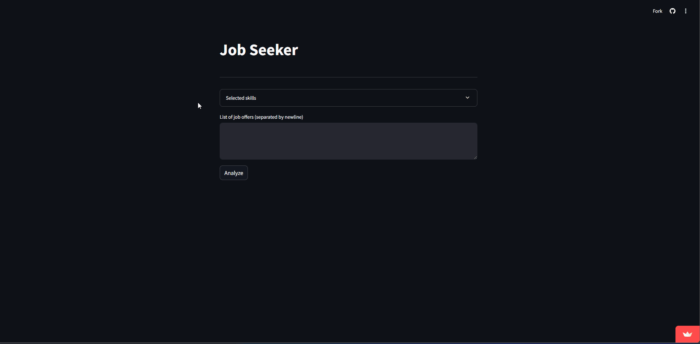

# JobSeeker

<p align="center">
  
</p>

## Description
In today's fast-paced world, the rapid evolution of technology is reshaping
industries and job markets at an unprecedented rate. As new technologies emerge
and existing ones evolve, the skills required for many professions are constantly
shifting. Employers are seeking candidates with up-to-date expertise in the latest
technologies.

However, manually analyzing job descriptions to identify the required skills can
be time-consuming and inefficient. This app addresses this challenge by automating
the extraction of essential skills from job offers. Whether it's identifying
technical proficiencies, soft skills, or industry-specific qualifications, this
tool helps job seekers quickly pinpoint the competencies they need to focus on.
By leveraging the power of automation, our app enables users to keep up with the
evolving demands of the modern job market, streamlining the job search process
and ensuring they stay ahead in their careers.

## Installation

`JobSeeker` offers a simple and intuitive interface based on a **Streamlit** app,
providing flexibility in how you choose to run it. You can use `JobSeeker`
either directly through **Streamlit Cloud** or run it locally on your machine:

### Streamlit App

You can access and use `JobSeeker` without any local setup through
**Streamlit Cloud** by visiting the following link:
[https://job-seeker-app.streamlit.app/](https://job-seeker-app.streamlit.app/).

### Local Setup

For those who prefer to run the app locally, simply follow these steps:
1. Clone the repository to your local machine.
```bash
git clone https://github.com/ocriado91/JobSeeker
cd JobSeeker
```
2. Install the required dependencies by running
```bash
pip install -r requirements.txt
```
3. Launch the app with the command
```bash
streamlit run src/app.py
```
4. Open the provided URL in your browser to start using the app.

## How to use?

### Extract skills from a set of job offers


### Add and remove skills

